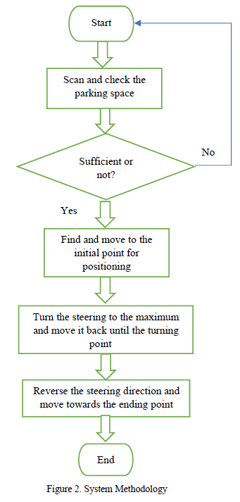

# Autonomous Mobile Robot

## Introduction

Autonomous mobile robots are revolutionizing industries with their ability to operate independently without human intervention. These robots are equipped with sensors, processors, and algorithms that enable them to perceive their surroundings, make decisions, and navigate complex environments safely and efficiently.

This bachelors thesis project provided a hands-on experience to build a robot and explore various core concepts in robotics, such as Perception, Planning, Controls, and Modeling. By applying these concepts to a real robot, our ultimate goal is to achieve autonomy. This project mainly involves lane detection, parking space detection, and development of lane and park assist systems.

   
  <em>Figure: Autonomous Mobile Robot</em>

## Methodology
- Literature review
- Development of CAD model
- Hardware assembly
- Design codes for steering and movements
- Develop codes for perception
- Integration of Hardware and Software components

## Video Demo

   
  <em>Figure: Working Model Demonstration</em>

## Requirements:
Key hardware components:

1. From scratch custom build chassis
2. Raspberry Pi and Pi Camera
3. Magnetic Encoders
4. H-Bridge
5. IMU and Arduino Nano
6. Ultrasonic Sensor
7. DC Geared Motors and wheels
8. Li Batteries
9. Servo Motor

Software components:
1. CPP
2. Python
3. Arduino IDE
4. OpenCV

### CAD model

   
  <em>Figure: CAD Model</em>

### Flow Diagram
The autonomous mobile robot operates independently, performing tasks by integrating fundamental robotics principles such as perception, localization, control, and navigation. The following process flow diagram offers an overview of how the robot accomplishes tasks through the integration of both software and hardware components:

   
  <em>Figure: Flow diagram</em>

### Codes : 
For more info on running the project : "SELF DRIVING CAR CODES" section

## Demo videos:
More working videos click [here](./Demo%20videos/) 

